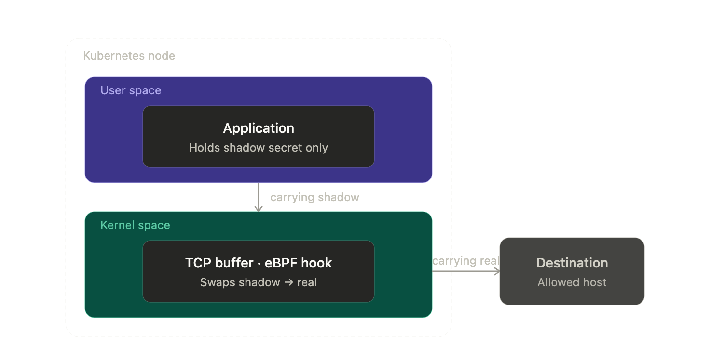

The last two weeks have been exciting for us. We announced Kloak, released v0.1.0, and the community response has been incredible — more than 150 stars on GitHub. In this post we want to answer some of the recurring questions we received, and share our vision for how Kloak fits into the broader secrets management landscape.

## The purpose

The main purpose of Kloak is to limit the blast radius of a breached application. Once an attacker is inside an application, the first move is usually to exfiltrate every secret in reach — environment variables, mounted files, in-memory credentials. Each of those secrets is a foothold to escalate the breach: from a single low-value app to other services, or to high-value assets like databases.

## Why now?

Until now, secrets management has focused on two things:

- Securing secrets at rest
- Securing the delivery of secrets to applications

A plethora of tools exist in the Kubernetes landscape to help with both. [Vault](https://developer.hashicorp.com/vault) and [OpenBao](https://openbao.org/) act as a secret vault (sealing and encrypting secrets at rest) and as a delivery mechanism through their operators, which avoids secrets being stored in the Kubernetes etcd database. More recently, [Sealed Secrets](https://github.com/bitnami-labs/sealed-secrets) extended this further by encrypting secrets so they can be safely committed to git, and decrypting them in-cluster only at delivery time.

While all of those tools provide a good solution to secure secrets up to the point of delivery, none of them protect the secret at the application level. In other words, once the secret is delivered to the app, their job is successfully done and the app is entrusted with the secret.

The rapid rise of AI systems has changed three things that affect how we think about secrets:

- AI systems have [drastically lowered the bar for finding a zero-day in a given app](https://red.anthropic.com/2026/zero-days/), by multiple orders of magnitude.
- AI agents are highly stateful and have a memory that, if contaminated with a secret, can persist that secret across many interactions.
- AI agents are unpredictable; we cannot guarantee what actions they will perform.

This bring us to conclude that **applications can no longer be trusted with secrets.** That is the gap Kloak fills. Kloak's goal is to complement existing tools by ensuring secrets are never handed to the app.

## How?

Kloak has three requirements:

- A secret cannot be visible to the app, neither in its environment nor in its memory.
- Secrets can only be sent to the hosts they are meant to reach.
- Kloak should be 100% transparent to the app.

To achieve this, Kloak leverages the Kubernetes controller pattern to intercept Secret resources and workloads, and mutates them so that real secrets never make their way to the app environment. Instead, a shadow secret is injected.

In addition, Kloak attaches to various eBPF hooks in the application and network layer and listens to the app's behavior, with the goal of detecting the use of the shadow secret when the app uses the secret to authenticate with an allowed host.

Finally, Kloak replaces the secret in the kernel-space TCP buffer after TLS encryption, so that the application never has access to the real value.

## More to come soon

Next, we will publish a more detailed post that explains the technical underpinnings of Kloak and how it ensures applications never have access to secrets.

You can [subscribe to the RSS feed](/blog/rss.xml) or follow [Kloak on GitHub](https://github.com/spinningfactory/kloak) for updates.

Thanks for reading. More soon.
