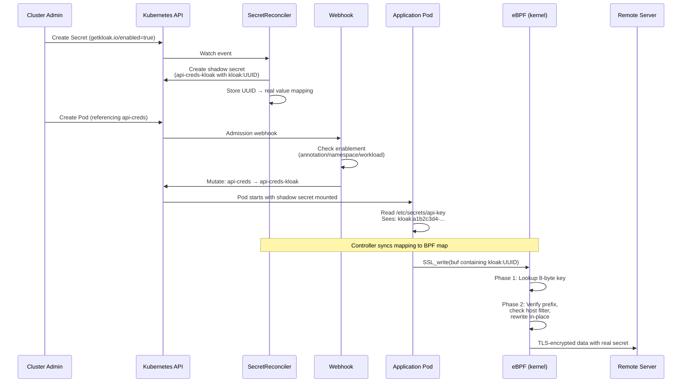
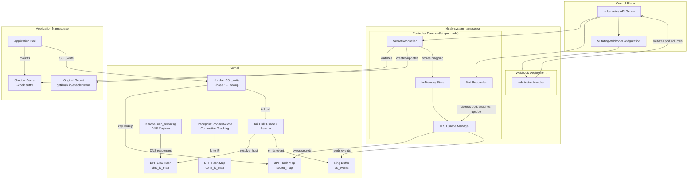

# Architecture Overview

Kloak is a Kubernetes-native secret protection system that uses eBPF to rewrite secret placeholders with real values inside the kernel, just before TLS encryption. Applications never see actual secrets -- they work with harmless UUID placeholders that are transparently substituted at the lowest possible level.

## Components

Kloak consists of three main components deployed in the `kloak-system` namespace:

### Controller (DaemonSet)

The controller runs as a **DaemonSet** -- one pod per node -- because eBPF programs must be loaded on the same kernel where the target processes run.

It performs three functions:

1. **SecretReconciler** -- Watches Kubernetes Secrets labeled `getkloak.io/enabled=true`. For each enabled secret, creates a shadow secret (`<name>-kloak`) containing length-matched `kloak:<UUID>` placeholders. Stores the UUID-to-real-value mappings with allowed host metadata.

2. **Pod Reconciler** -- Watches Pods annotated `getkloak.io/enabled=true` on the local node. When a matching pod is detected, resolves the container's PID via cgroup, then delegates to the TLS Uprobe Manager.

3. **TLS Uprobe Manager** -- Loads eBPF programs into the kernel, attaches uprobes to the container process's TLS write functions, syncs the secret map to the BPF hash map every 5 seconds, and polls the ring buffer for rewrite events.

The controller also generates TLS certificates for the webhook on startup and patches the `MutatingWebhookConfiguration` with the CA bundle.

### Webhook (Deployment)

The webhook runs as a standard **Deployment** (typically 1 replica). It is a Kubernetes mutating admission webhook registered for `CREATE` operations on pods.

When a pod is created in a namespace labeled `getkloak.io/enabled=true`:

1. Checks if Kloak is enabled for this pod (pod annotation, namespace label, or owner workload label/annotation)
2. Scans all Secret-backed volumes in the pod spec
3. For each enabled secret, rewrites `secretName` from `original` to `original-kloak`
4. Adds `getkloak.io/enabled: "true"` annotation to the pod

The webhook waits for the controller to generate TLS certificates before starting (via an init container).

### eBPF Programs

The eBPF programs run in-kernel and are loaded by the controller. They use a **two-phase tail-call design**:

- **Phase 1 (uprobe handler):** Fires on `SSL_write`, `SSL_write_ex`, or `crypto/tls.(*Conn).Write`. Reads the first 8 bytes of the TLS write buffer. If they match a known `kloak:` prefix key in the BPF hash map, performs a tail call to Phase 2.

- **Phase 2 (rewrite program):** Verifies the full prefix (up to 42 bytes), checks the allowed host against the cached connection hostname, and if everything matches, overwrites the placeholder bytes in the user-space write buffer with the real secret value.

Additional eBPF programs provide DNS-verified host resolution:
- **DNS Kprobe** (`udp_recvmsg`) -- intercepts all DNS responses on the node, parses A/AAAA records for watched hostnames, and stores IP → hostname mappings in `dns_ip_map`
- **Connect Tracepoints** (`sys_enter/exit_connect`) -- tracks TCP connections (fd → destination IP) in `conn_ip_map`. When the IP exists in `dns_ip_map`, caches the fd in `last_verified_fd`
- **Close Tracepoint** (`sys_enter_close`) -- cleans up `conn_ip_map` entries when file descriptors are closed, preventing stale mappings after fd reuse

## Data Flow

## System Architecture Diagram

## Security Model

Kloak's security model is built on a fundamental principle: **real secret values never enter application memory**.

### What the Application Sees

The application mounts a shadow secret containing `kloak:<UUID>` placeholders. When it reads `/etc/secrets/api-key`, it gets something like `kloak:a1b2c3d4-e5f6-7890-abcd-ef1234567890`. This value is meaningless to an attacker -- it is a random UUID that changes with each secret reconciliation.

### Where Real Secrets Live

Real secret values exist in exactly two places:

1. **Controller process memory** -- The in-memory store maps UUIDs to real values. This runs in the privileged `kloak-system` namespace with restricted RBAC.

2. **eBPF map (kernel memory)** -- The `secret_map` BPF hash map contains the UUID-to-real-value mappings. This is kernel memory, inaccessible to user-space processes (including the application container).

### The Rewrite Path

When the application calls `SSL_write()` with a buffer containing `kloak:<UUID>`:

1. The eBPF uprobe fires **before** the TLS library encrypts the data
2. The program scans the write buffer, finds the `kloak:` prefix
3. Looks up the real value in the BPF map
4. **Overwrites the buffer in-place** with the real value
5. Returns control to the TLS library, which encrypts and sends the real value

The real value passes through the kernel's TLS encryption path but is never visible in the application's readable memory (the overwrite happens in the uprobe context, which is a kernel execution context).

### Host Filtering Enforcement

The eBPF program enforces host filtering at the kernel level. Even if an attacker achieves arbitrary code execution in the container:

- They cannot read the real secret from memory (it was never there)
- They cannot modify the BPF map (requires `CAP_BPF` + `CAP_SYS_ADMIN`, only the controller has these)
- They cannot send the secret to an unauthorized host (the eBPF program checks the destination before rewriting)
- They could attempt to call `SSL_write` with a known `kloak:` UUID to a different host, but host filtering blocks the rewrite

### Privileged Access Requirements

The controller DaemonSet requires elevated privileges:

| Capability | Purpose |
|---|---|
| `CAP_BPF` | Load eBPF programs and create BPF maps |
| `CAP_NET_ADMIN` | Attach network-related eBPF programs |
| `CAP_SYS_ADMIN` | Access `/proc/<pid>/` for uprobe attachment |
| `CAP_SYS_RESOURCE` | Increase BPF map memory limits |
| `hostPID: true` | Resolve container PIDs for uprobe attachment |
| `privileged: true` | Required for eBPF operations on most Kubernetes distributions |

::: warning
The controller runs as a privileged DaemonSet. Restrict access to the `kloak-system` namespace with tight RBAC policies. Only cluster administrators should be able to modify resources in this namespace.
:::

## BPF Map Layout

| Map | Type | Key | Value | Purpose |
|---|---|---|---|---|
| `secret_map` | Hash | 8-byte prefix (`kloak:XX`) | Real value (128B) + host (32B) + full prefix (42B) | UUID-to-secret lookup |
| `dns_ip_map` | LRU Hash | IP address (16B) | Hostname (32B) + TTL + timestamp | DNS response → IP-to-hostname cache |
| `conn_ip_map` | Hash | {tgid, fd} | IP address (16B) | TCP connection → destination IP |
| `last_verified_fd` | Hash | tgid | fd | Last fd whose IP matched a DNS-verified host |
| `watched_hosts` | Hash | Hostname (32B) | 1 | Set of hostnames to capture DNS for |
| `prog_array` | ProgArray | Index 0 | Phase 2 program FD | Tail call from Phase 1 to Phase 2 |
| `tls_events` | RingBuf | -- | Event struct (pid, len, is_rewritten) | Observability: rewrite events |
