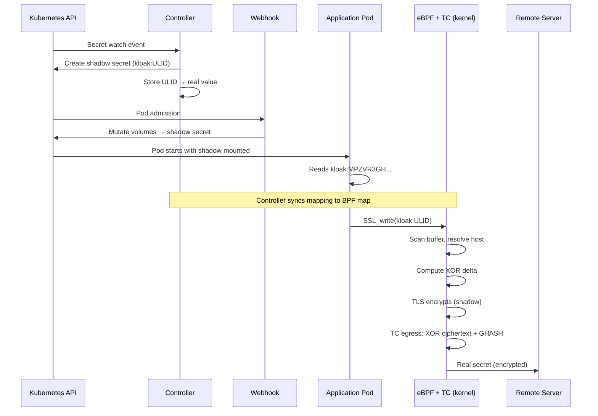
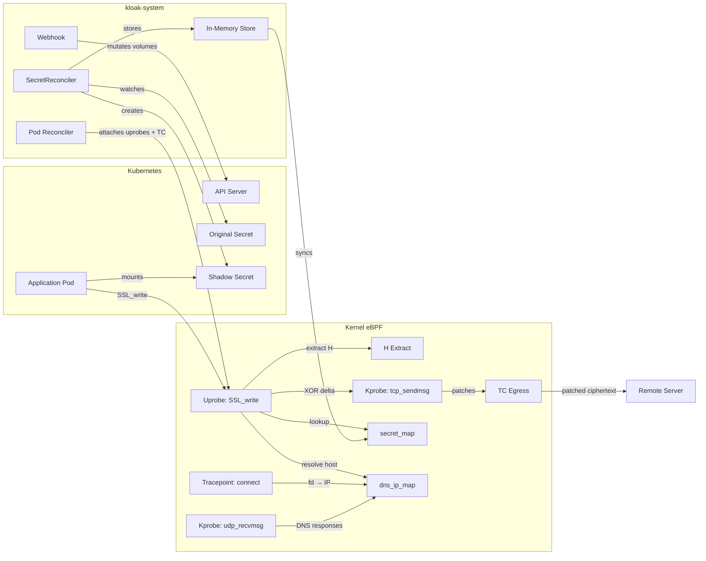

# Architecture Overview

Kloak is a Kubernetes-native secret protection system that uses eBPF to rewrite secret placeholders with real values at the kernel level, after TLS encryption. Applications never see actual secrets -- they work with harmless ULID placeholders that are transparently substituted in the encrypted output.

## Components

Kloak consists of three main components deployed in the `kloak-system` namespace:

### Controller (DaemonSet)

The controller runs as a **DaemonSet** -- one pod per node -- because eBPF programs must be loaded on the same kernel where the target processes run.

It performs four functions:

1. **SecretReconciler** -- Watches Kubernetes Secrets labeled `getkloak.io/enabled=true`. For each enabled secret, creates a shadow secret (`<name>-kloak`) containing length-matched `kloak:<ULID>` placeholders. Stores the ULID-to-real-value mappings with allowed host and port metadata in an in-memory store.

2. **Pod Reconciler** -- Watches Pods annotated `getkloak.io/enabled=true` on the local node. When a matching pod is detected, resolves each container's cgroup ID, then delegates to the TLS Uprobe Manager. Failed attachments are retried every 500ms (handles runtimes like Python where `libssl` loads lazily).

3. **TLS Uprobe Manager** -- Loads eBPF programs into the kernel, attaches uprobes to each container process's TLS write functions, attaches TC egress programs to container network interfaces, syncs the secret map to BPF every 5 seconds, and polls the ring buffer for rewrite events. Also tracks process lifecycle (exec/exit) in tracked cgroups to attach uprobes to newly spawned processes.

4. **Trusted DNS Discovery** -- Auto-discovers the `kube-dns` ClusterIP from the `kube-system/kube-dns` service and populates the `trusted_dns_servers` BPF map. Only DNS responses from trusted servers are used for host filtering. Additional servers can be configured via the `--trusted-dns-servers` flag.

### Webhook (Deployment)

The webhook runs as a standard **Deployment** (typically 1 replica). It is a Kubernetes mutating admission webhook registered for `CREATE` operations on pods.

When a pod is created:

1. Checks if Kloak is enabled for this pod (pod annotation, namespace label, or owner workload label/annotation)
2. Scans all Secret-backed volumes in the pod spec
3. For each volume referencing a secret that has a shadow copy, rewrites `secretName` from `original` to `original-kloak`
4. Adds `getkloak.io/enabled: "true"` annotation to the pod so the controller knows to attach eBPF uprobes

### eBPF Programs

The eBPF programs run in-kernel and are loaded by the controller. The secret rewriting pipeline has three stages:

#### Stage 1: Uprobe -- Scan and Compute

When `SSL_write` or `crypto/tls.(*Conn).Write` is called, the uprobe fires and:

1. Reads the plaintext write buffer (up to 256 bytes per chunk, scanning the full buffer via `bpf_loop`)
2. Pre-scans for `kloak:` prefixes (8-byte key match), finding up to 4 matches per call
3. For each match, looks up the real secret value in the `secret_map` BPF hash map
4. Resolves the destination hostname via the DNS trust chain (see below)
5. Checks the resolved hostname and port against the secret's allowed host/port
6. Computes XOR deltas: `xor_delta[i] = shadow_byte[i] ^ real_byte[i]` for each matched secret
7. Stores the pending patches in `xor_pending` (keyed by thread ID)

The uprobe also extracts the GHASH key H from the TLS connection's internal structures on first write. For OpenSSL 3.2+, this follows a 4-hop pointer chain through the SSL struct. For Go `crypto/tls`, it reads H*2 from the GCM productTable and applies GF(2^128) halving.

#### Stage 2: Kprobe -- Bridge to Network

A kprobe on `tcp_sendmsg` fires when the TLS library sends the encrypted data:

1. Reads the pending patches from `xor_pending`
2. Extracts the source port from the socket
3. Builds a `tc_pending` entry keyed by `(destination IP, source port, cgroup ID)`
4. The patches are now ready for the TC egress program

#### Stage 3: TC Egress -- Patch Ciphertext

A TC (traffic control) egress program attached to the container's network interfaces (`eth0` and `lo`) intercepts outbound packets:

1. Looks up `tc_pending` by matching the packet's destination IP, source port, and cgroup
2. For each patch, XORs the corresponding ciphertext bytes: `CT_real = CT_shadow XOR xor_delta`
3. Recomputes the GHASH authentication tag using precomputed H powers (GF(2^128) multiplication)
4. Patches the authentication tag in the TLS record
5. The packet leaves the node with the real secret encrypted -- no user-space memory ever held the real value

::: tip Why XOR patching works
AES-GCM in counter mode (CTR) encrypts via `ciphertext = plaintext XOR keystream`. If you know the XOR difference between the shadow and real values, you can patch the ciphertext directly: `CT_real = CT_shadow XOR (shadow XOR real)`. The keystream cancels out. The GHASH tag must be recomputed because the ciphertext changed.
:::

#### Go Plaintext Path

For Go `crypto/tls`, an alternative path writes the real secret directly into the user-space buffer before encryption (tail-call index 3). This is used when the XOR-patch path is not available (e.g., GHASH H extraction failed).

#### DNS-Verified Host Resolution

Additional eBPF programs build a chain of trust from DNS resolution to TLS write:

- **DNS Kprobe** (`udp_recvmsg`) -- Intercepts DNS responses on the node. Validates the source against the `trusted_dns_servers` whitelist. For hostnames in the `watched_hosts` set, stores resolved A/AAAA records in `dns_ip_map` with TTL.
- **Connect Tracepoints** (`sys_enter/exit_connect`) -- Tracks TCP connections (fd to destination IP) in `conn_ip_map`. When the destination IP exists in `dns_ip_map`, caches the fd in `last_verified_fd` for fast lookup.
- **Close Tracepoint** (`sys_enter_close`) -- Cleans up `conn_ip_map` entries when file descriptors are closed, preventing stale mappings after fd reuse.

At TLS write time, `resolve_host()` chains: `ssl_fd_map` (cache) -> `last_verified_fd` -> `conn_ip_map[{tgid, fd}]` -> `dns_ip_map[ip]` to determine the hostname.

## Data Flow

```mermaid
sequenceDiagram
    participant K8s as Kubernetes API
    participant Ctrl as Controller
    participant WH as Webhook
    participant App as Application Pod
    participant BPF as eBPF + TC (kernel)
    participant Remote as Remote Server

    K8s->>Ctrl: Secret watch event
    Ctrl->>K8s: Create shadow secret (kloak:ULID)
    Ctrl->>Ctrl: Store ULID → real value

    K8s->>WH: Pod admission
    WH->>K8s: Mutate volumes → shadow secret

    K8s->>App: Pod starts with shadow mounted
    App->>App: Reads kloak:MPZVR3GH...

    Note over Ctrl,BPF: Controller syncs mapping to BPF map

    App->>BPF: SSL_write(kloak:ULID)
    BPF->>BPF: Scan buffer, resolve host
    BPF->>BPF: Compute XOR delta
    BPF->>BPF: TLS encrypts (shadow)
    BPF->>BPF: TC egress: XOR ciphertext + GHASH
    BPF->>Remote: Real secret (encrypted)
```

## System Architecture Diagram

```mermaid
graph LR
    subgraph K8s["Kubernetes"]
        API[API Server]
        SEC[Original Secret]
        SHAD[Shadow Secret]
        POD[Application Pod]
    end

    subgraph Kloak["kloak-system"]
        WH[Webhook]
        SR[SecretReconciler]
        PR[Pod Reconciler]
        MS[In-Memory Store]
    end

    subgraph Kernel["Kernel eBPF"]
        UP[Uprobe: SSL_write]
        HX[H Extract]
        KP_TCP[Kprobe: tcp_sendmsg]
        TC[TC Egress]
        KP_DNS[Kprobe: udp_recvmsg]
        TP[Tracepoint: connect]
        BPF[secret_map]
        DNS[dns_ip_map]
    end

    Remote[Remote Server]

    SR -->|watches| SEC
    SR -->|creates| SHAD
    SR -->|stores| MS
    MS -->|syncs| BPF
    WH -->|mutates volumes| API
    PR -->|attaches uprobes + TC| UP

    POD -->|mounts| SHAD
    POD -->|SSL_write| UP
    UP -->|lookup| BPF
    UP -->|extract H| HX
    UP -->|XOR delta| KP_TCP
    KP_TCP -->|patches| TC
    TC -->|patched ciphertext| Remote
    KP_DNS -->|DNS responses| DNS
    TP -->|fd → IP| DNS
    UP -->|resolve host| DNS
```

## Security Model

Kloak's security model is built on a fundamental principle: **real secret values never enter application memory**.

### What the Application Sees

The application mounts a shadow secret containing `kloak:<ULID>` placeholders. When it reads `/etc/secrets/api-key`, it gets something like `kloak:MPZVR3GHWT4E6YBCA01JQXK5N8`. This value is meaningless to an attacker -- it is a random ULID that changes with each secret reconciliation.

### Where Real Secrets Live

Real secret values exist in exactly two places:

1. **Controller process memory** -- The in-memory store maps ULIDs to real values. This runs in the privileged `kloak-system` namespace with restricted RBAC.

2. **eBPF map (kernel memory)** -- The `secret_map` BPF hash map contains the ULID-to-real-value mappings. This is kernel memory, inaccessible to user-space processes (including the application container).

### The Rewrite Path

When the application calls `SSL_write()` with a buffer containing `kloak:<ULID>`:

1. The eBPF uprobe fires **before** the TLS library encrypts the data
2. The program scans the write buffer and finds the `kloak:` prefix
3. Looks up the real value in the BPF map
4. Computes the XOR difference between the shadow and real values
5. The TLS library encrypts the buffer (still containing the shadow value)
6. When the encrypted packet hits TC egress, the XOR delta is applied to the ciphertext
7. The GHASH authentication tag is recomputed for the modified ciphertext
8. The packet leaves the node carrying the real secret, encrypted -- **the real value was never in user-space memory**

### Host Filtering Enforcement

The eBPF program enforces host filtering at the kernel level. Even if an attacker achieves arbitrary code execution in the container:

- They cannot read the real secret from memory (it was never there)
- They cannot modify the BPF map (requires `CAP_BPF` + `CAP_SYS_ADMIN`, only the controller has these)
- They cannot send the secret to an unauthorized host (the eBPF program checks the destination before computing XOR deltas)
- They could attempt to call `SSL_write` with a known `kloak:` ULID to a different host, but host filtering blocks the rewrite
- DNS responses are validated against a trusted server whitelist, preventing DNS spoofing attacks within the cluster

### Privileged Access Requirements

The controller DaemonSet requires elevated privileges:

| Capability | Purpose |
|---|---|
| `CAP_BPF` | Load eBPF programs and create BPF maps |
| `CAP_NET_ADMIN` | Attach TC egress programs to container network interfaces |
| `CAP_SYS_ADMIN` | Access `/proc/<pid>/` for uprobe attachment, kprobe/tracepoint attachment |
| `CAP_SYS_RESOURCE` | Increase BPF map memory limits |
| `hostPID: true` | Resolve container PIDs and access `/proc/<pid>/ns/net` for TC attachment |
| `privileged: true` | Required for eBPF operations on most Kubernetes distributions |

::: warning
The controller runs as a privileged DaemonSet. Restrict access to the `kloak-system` namespace with tight RBAC policies. Only cluster administrators should be able to modify resources in this namespace.
:::

## BPF Map Layout

### Core Maps

| Map | Type | Key | Value | Purpose |
|---|---|---|---|---|
| `secret_map` | Hash | 8-byte prefix (`kloak:XX`) | Real value (128B) + host (64B) + port + protocol + full prefix (42B) | ULID-to-secret lookup |
| `tls_conn_state` | LRU Hash | {tgid, ssl_ptr} | GHASH H (16B) + H powers (16x16B) + cipher type | Per-connection TLS state for GHASH recomputation |
| `xor_pending` | Hash | pid_tgid | Patches (up to 4) with offset, length, XOR delta | Uprobe to kprobe bridge: pending ciphertext patches |

### DNS and Connection Tracking

| Map | Type | Key | Value | Purpose |
|---|---|---|---|---|
| `dns_ip_map` | LRU Hash | IP address (16B) | Hostname (64B) + TTL + timestamp | DNS-verified IP-to-hostname cache |
| `conn_ip_map` | LRU Hash | {tgid, fd} | IP address (16B) + port | TCP connection to destination IP |
| `last_verified_fd` | Hash | tgid | fd | Last fd whose IP matched a DNS-verified host |
| `ssl_fd_map` | LRU Hash | {tgid, ssl_ptr} | fd | SSL connection to fd cache |
| `watched_hosts` | Hash | Hostname (64B) | 1 | Set of hostnames to capture DNS for |
| `trusted_dns_servers` | Hash | IP address (16B) | 1 | Trusted DNS server whitelist |

### Process and Container Tracking

| Map | Type | Key | Value | Purpose |
|---|---|---|---|---|
| `tracked_cgroups` | Hash | cgroup inode ID | 1 | Containers with eBPF enabled |
| `tracked_tgids` | Hash | tgid | 1 | Processes opted in for DNS/connect tracking |

### Program Control

| Map | Type | Key | Value | Purpose |
|---|---|---|---|---|
| `prog_array` | ProgArray | Index 1-3 | Program FDs | Tail calls: 1=XOR patch, 2=H extract, 3=Go write path |
| `tc_prog_array` | ProgArray | Index 0 | Program FD | TC tail call: GHASH tag recomputation |
| `tls_events` | RingBuf | -- | Event struct (pid, len, is_rewritten) | Observability: rewrite events to userspace |
| `proc_events` | RingBuf | -- | Exec/exit events | Process lifecycle events for uprobe attachment |
