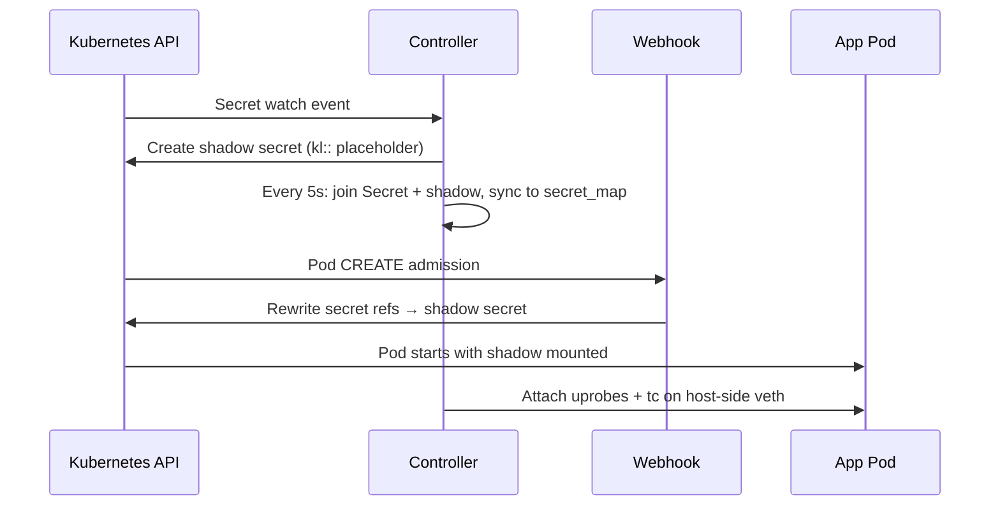
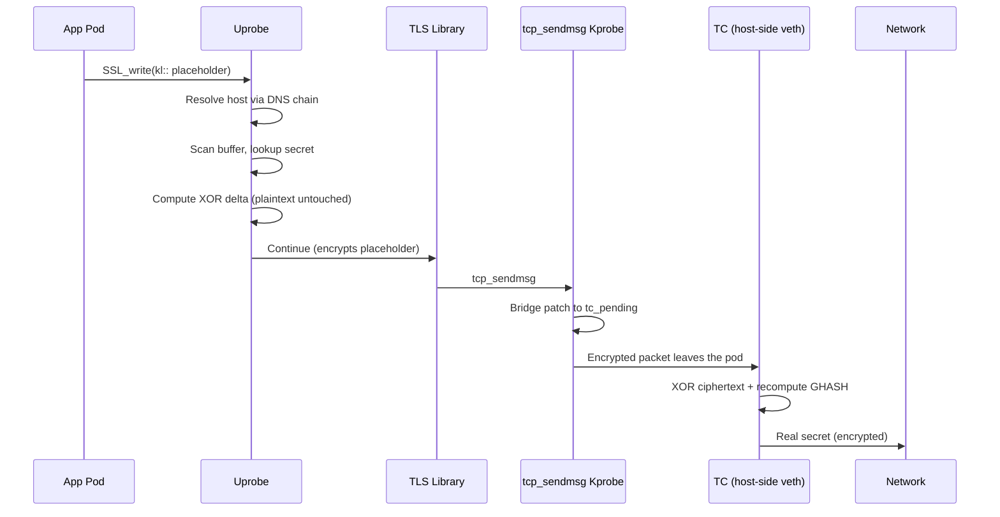

# Architecture Overview

Kloak is a Kubernetes-native secret protection system that uses eBPF to rewrite secret placeholders with real values at the kernel level, after TLS encryption. Applications never see actual secrets -- they work with harmless `kl::` placeholders that are transparently substituted in the encrypted output.

## Components

Kloak consists of three main components deployed in the `kloak-system` namespace:

### Controller (DaemonSet)

The controller runs as a **DaemonSet** -- one pod per node -- because eBPF programs must be loaded on the same kernel where the target processes run.

It performs four functions:

1. **SecretReconciler** -- Watches Kubernetes Secrets labeled `getkloak.io/enabled=true`. For each enabled secret, creates a shadow secret (`<name>-kloak`, owned by the original and labeled `getkloak.io/managed=true`) whose values are `kl::` placeholders: `kl::` followed by random characters, with exactly the same byte length and the same HPACK Huffman bit length as the real value (so HTTP/2 rewrites stay valid). There is no separate in-memory store: every 5 seconds the controller joins each enabled Secret with its shadow from its informer cache, reads the `getkloak.io/hosts` / `getkloak.io/port` annotations, and syncs placeholder-prefix -> real-value entries into the `secret_map` BPF map.

2. **Pod Reconciler** -- Watches Pods annotated `getkloak.io/enabled=true` on the local node. When a matching pod is detected, resolves each container's cgroup ID, then delegates to the TLS Uprobe Manager. Failed attachments are retried every 500ms (handles runtimes like Python where `libssl` loads lazily).

3. **TLS Uprobe Manager** -- Loads eBPF programs into the kernel, attaches uprobes to each container process's TLS write functions, attaches the tc patch program at tc ingress on the host-side veth peer of the pod's egress interface (TCX), syncs the secret map to BPF every 5 seconds, and polls the ring buffer for rewrite events. Also tracks process lifecycle (exec/exit) in tracked cgroups to attach uprobes to newly spawned processes.

4. **Trusted DNS Discovery** -- Auto-discovers the `kube-dns` ClusterIP from the `kube-system/kube-dns` service and populates the `trusted_dns_servers` BPF map. Only DNS responses from trusted servers are used for host filtering. Additional servers can be configured via `controller.dns.trustedServers` (the `--trusted-dns-servers` flag).

### Webhook (Deployment)

The webhook runs as a standard **Deployment** (typically 1 replica). It serves a mutating admission webhook for pod `CREATE` and a validating admission webhook for Secrets.

One `MutatingWebhookConfiguration` (`kloak-mutating-webhook`) contains two webhooks that ensure only kloak-enabled workloads are sent to the webhook (both use `failurePolicy: Fail` and never match the Kloak release namespace):
- **Namespace-scoped:** matches namespaces labeled `getkloak.io/enabled=true`
- **Pod-scoped:** matches pods labeled `getkloak.io/enabled=true` via `objectSelector`

Non-kloak workloads are never affected, even if the webhook is down.

When a pod is matched:

1. Checks if Kloak is enabled for this pod: if the pod has the `getkloak.io/enabled` label, its value decides (`"false"` opts out even in an enabled namespace); otherwise the namespace label decides
2. Scans Secret references in the pod spec: `volumes[].secret`, `env[].valueFrom.secretKeyRef`, and `envFrom[].secretRef` (containers, initContainers, and ephemeralContainers). Projected volume sources are not rewritten.
3. For each reference to a kloak-enabled secret, rewrites the name from `original` to `original-kloak`
4. **Rejects** the pod if any kloak-enabled secret's shadow does not exist yet or is not Kloak-managed (fail-closed)
5. Adds `getkloak.io/enabled: "true"` annotation to the pod so the controller knows to attach eBPF uprobes

A `ValidatingWebhookConfiguration` (`kloak-validating-webhook`, `failurePolicy: Fail`) checks `CREATE`/`UPDATE` of Secrets labeled `getkloak.io/enabled=true`. It rejects `getkloak.io/hosts` or `getkloak.io/port` set as labels instead of annotations, invalid or multi-host values, hosts longer than 63 bytes, invalid ports, Secrets with no data, values shorter than 8 or longer than 128 bytes, and values whose Huffman density cannot be matched by a same-length `kl::` placeholder.

### eBPF Programs

The eBPF programs run in-kernel and are loaded by the controller. The secret rewriting pipeline has three stages:

#### Stage 1: Uprobe -- Scan and Compute

When `SSL_write` or `crypto/tls.(*Conn).Write` is called, the uprobe fires and:

1. Reads the plaintext write buffer (up to 256 bytes per chunk, scanning the full buffer via `bpf_loop`)
2. Resolves the destination hostname via the DNS trust chain (see below)
3. Pre-scans for the `kl::` prefix (or its HPACK Huffman encoding, for HTTP/2), finding up to 4 matches per call
4. For each match, uses the 8 bytes at the match as the key to look up the real secret value in the `secret_map` BPF hash map
5. Checks the resolved hostname, IP, and port against the secret's allowed host/IP/port
6. Computes XOR deltas: `xor_delta[i] = shadow_byte[i] ^ real_byte[i]` for each matched secret
7. Stores the pending patches in `xor_pending` (keyed by process ID / tgid). The plaintext buffer is not modified.

The GHASH key H is obtained per connection. For OpenSSL, uprobes on libcrypto's `EVP_CipherInit_ex` capture H when the cipher is keyed and cache it in `evp_h_cache`; an `h_extract` tail call looks it up on write (or reads it live on a cache miss). If the libcrypto hook is unavailable, the `tcp_sendmsg` kprobe walks the SSL struct itself (3-hop chain for OpenSSL 3.0/3.1, 4-hop for 3.2+). For BoringSSL, H is recomputed from the AES round keys. For Go `crypto/tls`, the kprobe reads H*2 from the GCM productTable and applies GF(2^128) halving.

#### Stage 2: Kprobe -- Bridge to Network

A kprobe on `tcp_sendmsg` fires when the TLS library sends the encrypted data:

1. Reads the pending patches from `xor_pending`
2. Extracts the source port and destination IP from the socket (IPv4 destinations only)
3. Obtains H if the uprobe did not (Go, or the OpenSSL fallback walk). If H cannot be obtained, no patch is created and the placeholder is sent.
4. Builds a `tc_pending` entry keyed by `(destination IP, source port, cgroup ID)`, recording the TCP write sequence number to identify the right segment
5. The patches are now ready for the tc program

#### Stage 3: TC -- Patch Ciphertext

A tc (traffic control) program attached at tc ingress on the **host-side veth peer** (as a TCX link on Linux 6.6+, or a `clsact` + `cls_bpf` filter on older kernels) of the pod's egress interface intercepts the pod's outbound packets as they leave the pod. Patching outside the pod keeps the rewritten ciphertext out of reach of in-pod packet capture. Interfaces with no veth peer (e.g. `hostNetwork` pods) fall back to tc egress inside the pod netns, where a container with `CAP_NET_RAW` could capture the patched ciphertext -- drop `NET_RAW` for such workloads. Loopback is never patched, so same-pod traffic receives the placeholder.

1. Looks up `tc_pending` by matching the packet's destination IP, source port, and cgroup
2. For each patch, XORs the corresponding ciphertext bytes: `CT_real = CT_shadow XOR xor_delta`
3. Recomputes the GHASH authentication tag using precomputed H powers (GF(2^128) multiplication)
4. Patches the authentication tag in the TLS record
5. The packet leaves the node with the real secret encrypted -- the pod's memory never held the real value

::: tip Why XOR patching works
AES-GCM in counter mode (CTR) encrypts via `ciphertext = plaintext XOR keystream`. If you know the XOR difference between the shadow and real values, you can patch the ciphertext directly: `CT_real = CT_shadow XOR (shadow XOR real)`. The keystream cancels out. The GHASH tag must be recomputed because the ciphertext changed.

Only AES-128-GCM and AES-256-GCM cipher suites (TLS 1.2 and 1.3) are supported. ChaCha20-Poly1305 connections are not rewritten and send the placeholder.
:::

#### Go `crypto/tls`

Go `crypto/tls` uses the same XOR-patch pipeline. There is no plaintext fallback: if H cannot be obtained, the placeholder is sent.

#### DNS-Verified Host Resolution

Additional eBPF programs build a chain of trust from DNS resolution to TLS write:

- **DNS Kprobe** (`udp_recvmsg`) -- Intercepts DNS responses on the node. Validates the source against the `trusted_dns_servers` whitelist. For hostnames in the `watched_hosts` set, stores resolved A/AAAA records in `dns_ip_map` with TTL.
- **Connect Tracepoints** (`sys_enter/exit_connect`) -- Tracks TCP connections (fd to destination IP) in `conn_ip_map`. When the destination IP exists in `dns_ip_map`, caches the fd in `last_verified_fd` for fast lookup.
- **Close Tracepoint** (`sys_enter_close`) -- Cleans up `conn_ip_map` entries when file descriptors are closed, preventing stale mappings after fd reuse.

At TLS write time, `resolve_host()` finds the socket fd via `ssl_fd_map` (cache) -> the fd read from the SSL struct's write BIO -> `last_verified_fd`, then chains `conn_ip_map[{tgid, fd}]` -> `dns_ip_map[ip]` to determine the hostname. If no fd is found, it scans fds 3-30 in `conn_ip_map` for a DNS-verified destination.

## Admission Flow

When a secret and pod are created, the controller and webhook set up the shadow secret and mutate the pod:

```mermaid
sequenceDiagram
    participant K8s as Kubernetes API
    participant Ctrl as Controller
    participant WH as Webhook
    participant App as App Pod

    K8s->>Ctrl: Secret watch event
    Ctrl->>K8s: Create shadow secret (kl:: placeholder)
    Ctrl->>Ctrl: Every 5s: join Secret + shadow, sync to secret_map
    K8s->>WH: Pod CREATE admission
    WH->>K8s: Rewrite secret refs → shadow secret
    K8s->>App: Pod starts with shadow mounted
    Ctrl->>App: Attach uprobes + tc on host-side veth
```

## Secret Rewrite Flow

When the application makes a TLS call, the eBPF pipeline rewrites the secret in the encrypted output:

```mermaid
sequenceDiagram
    participant App as App Pod
    participant UP as Uprobe
    participant TLS as TLS Library
    participant KP as tcp_sendmsg Kprobe
    participant TC as TC (host-side veth)
    participant Net as Network

    App->>UP: SSL_write(kl:: placeholder)
    UP->>UP: Resolve host via DNS chain
    UP->>UP: Scan buffer, lookup secret
    UP->>UP: Compute XOR delta (plaintext untouched)
    UP->>TLS: Continue (encrypts placeholder)
    TLS->>KP: tcp_sendmsg
    KP->>KP: Bridge patch to tc_pending
    KP->>TC: Encrypted packet leaves the pod
    TC->>TC: XOR ciphertext + recompute GHASH
    TC->>Net: Real secret (encrypted)
```

## Security Model

Real secret values never enter application memory. The application only sees `kl::` placeholders. Real values exist in the original Secret (API server/etcd), in the controller's informer cache (which holds all Secrets cluster-wide), and in kernel-space BPF maps -- all inaccessible to application containers. The XOR-patch pipeline injects secrets into the ciphertext on the host side of the pod's veth, after TLS encryption, so they never pass through the pod's memory (except on interfaces without a veth peer, see above).

For the full threat model, trust chain, fail modes, and known limitations, see the [Security Model](/architecture/security-model) page.

## BPF Map Layout

### Core Maps

| Map | Type | Key | Value | Purpose |
|---|---|---|---|---|
| `secret_map` | Hash | First 8 bytes of the placeholder (`kl::xxxx`) or of its HPACK Huffman encoding | Real value (128B) + host (64B) + IP (16B) + port + protocol + full prefix (42B) | Placeholder-to-secret lookup (max 4096 entries; each secret uses up to 2) |
| `tls_conn_state` | LRU Hash | {tgid, ssl_ptr} | GHASH H (16B) + H powers (16x16B) + cipher type | Per-connection TLS state for GHASH recomputation |
| `xor_pending` | Hash | tgid | Patches (up to 4) with offset, length, XOR delta | Uprobe to kprobe bridge: pending ciphertext patches |
| `tc_pending` | LRU Hash | {dst IP, src port, cgroup ID} | Patches + TCP write sequence | Kprobe to tc bridge: patches for a specific connection |
| `tc_tag_pending` | LRU Hash | {dst IP, src port, cgroup ID} | GHASH tag delta | Deferred tag fix-up when the tag is in a later TCP segment |
| `evp_h_cache` | LRU Hash | {tgid, EVP_CIPHER_CTX ptr} | GHASH H | H captured at OpenSSL `EVP_CipherInit_ex` time |

### DNS and Connection Tracking

| Map | Type | Key | Value | Purpose |
|---|---|---|---|---|
| `dns_ip_map` | LRU Hash | IP address (16B) | Hostname (64B) + TTL + timestamp | DNS-verified IP-to-hostname cache |
| `conn_ip_map` | LRU Hash | {tgid, fd} | IP address (16B) + port | TCP connection to destination IP |
| `last_verified_fd` | Hash | tgid | fd | Last fd whose IP matched a DNS-verified host |
| `ssl_fd_map` | LRU Hash | {tgid, ssl_ptr} | fd | SSL connection to fd cache |
| `watched_hosts` | Hash | Hostname (64B) | 1 | Set of hostnames to capture DNS for |
| `trusted_dns_servers` | Hash | IP address (16B) | 1 | Trusted DNS server whitelist |

### Process and Container Tracking

| Map | Type | Key | Value | Purpose |
|---|---|---|---|---|
| `tracked_cgroups` | Hash | cgroup inode ID | 1 | Container cgroups whose TLS writes are scanned (registered by the controller, and by the exec tracepoint for container execs) |
| `tracked_tgids` | Hash | tgid | 1 | Container processes seen by the exec tracepoint (not used as a filter; DNS and connect tracking are node-wide) |

### Program Control

| Map | Type | Key | Value | Purpose |
|---|---|---|---|---|
| `prog_array` | ProgArray | Index 1-2 | Program FDs | Tail calls: 1=XOR patch, 2=H extract |
| `tc_prog_array` | ProgArray | Index 0 | Program FD | TC tail call: GHASH tag recomputation |
| `tls_events` | RingBuf | -- | Event struct (pid, tgid, len, is_rewritten) | Reserved for rewrite events to userspace (no program currently emits them) |
| `proc_events` | RingBuf | -- | Exec/exit events | Process lifecycle events for uprobe attachment |
